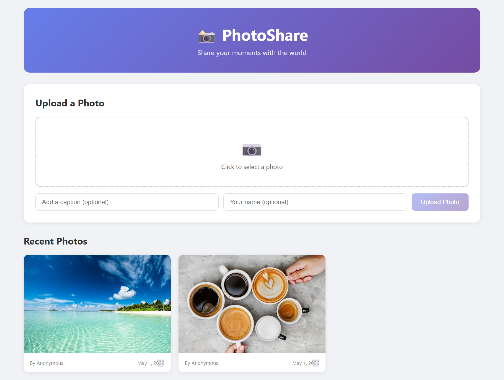
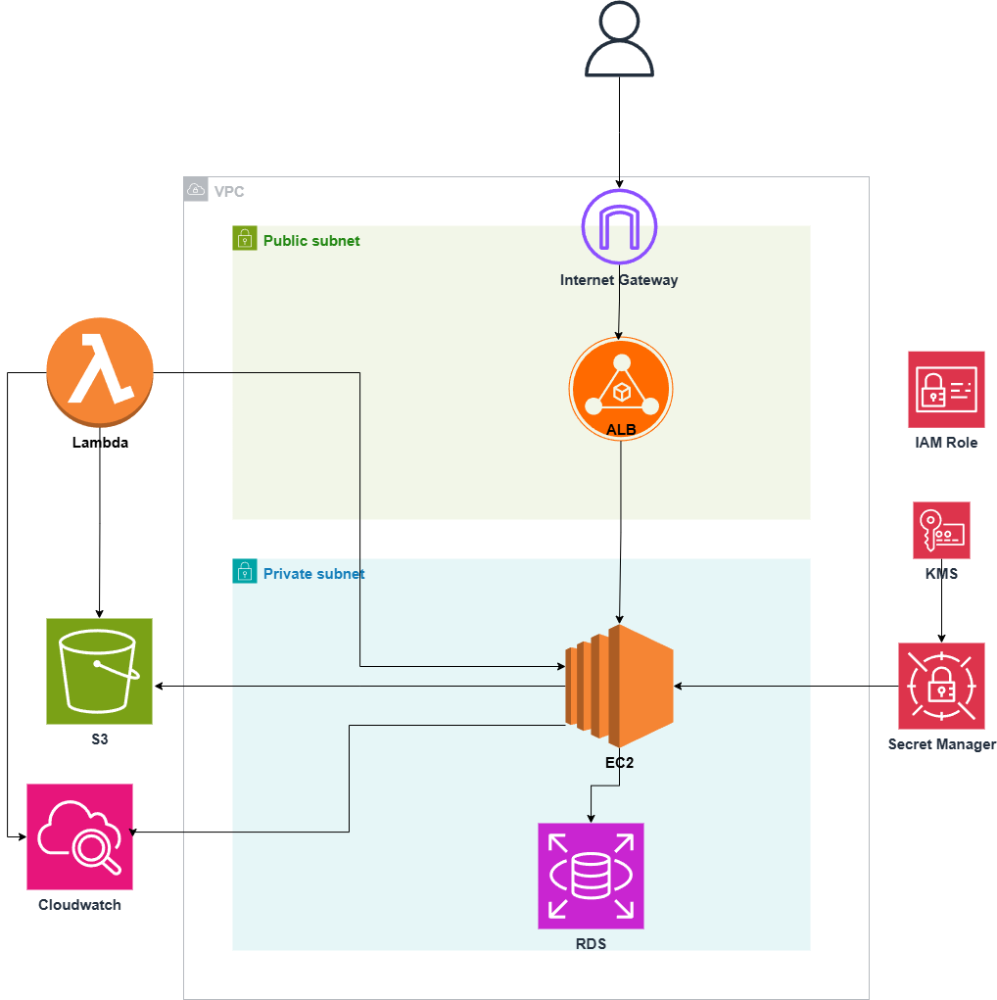
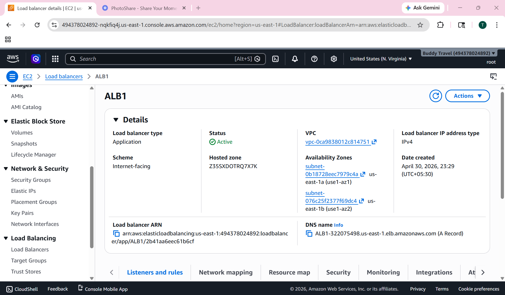

# PhotoShare App

A photo sharing application where anyone can upload and view photos. Built with Node.js + Express (backend) and React (frontend), served as a single service on one port.

## Application Screenshot



## AWS Architecture



```
Users → ALB → EC2 (Auto Scaling) → RDS (PostgreSQL)
                                        ↓
                                    S3 (Private, Presigned URLs)
                                        ↑
                                  Lambda (Metadata Extraction via ALB Webhook)
```

## AWS Console



## Tech Stack

- **Frontend**: React, Vite
- **Backend**: Node.js, Express, Sequelize ORM
- **Database**: Amazon RDS (PostgreSQL)
- **Storage**: Amazon S3 (private bucket, presigned URLs)
- **Serverless**: AWS Lambda (metadata extraction)
- **Load Balancing**: Application Load Balancer (ALB)
- **Scaling**: Auto Scaling Group (target tracking on CPU)
- **Secrets**: AWS Secrets Manager
- **IAM**: EC2 Instance Role (no hardcoded credentials)

## Key Design Decisions

| Decision | Approach |
|----------|----------|
| S3 Security | Bucket is fully private. Images served via presigned URLs (1hr expiry) |
| Secrets | No hardcoded credentials. All config from AWS Secrets Manager |
| Lambda Integration | Lambda sends metadata to app via ALB webhook — no direct DB access |
| Scaling | Stateless app behind ALB + ASG. Scales horizontally on CPU |
| Auth to AWS | EC2 IAM Role — no access keys stored anywhere |

## Setup

### 1. Install dependencies

```bash
npm run install:all
```

### 2. Configure environment

Copy `.env.example` to `.env` and fill in your values:

```bash
cp .env.example .env
```

Required config:
- `AWS_SECRET_NAME` — Secrets Manager secret name (loads DB/S3 config automatically)
- `AWS_REGION` — AWS region

### 3. Create S3 Bucket

Create an S3 bucket with **Block All Public Access enabled**. Images are served through presigned URLs — no public access needed.

### 4. Create PostgreSQL Database

```sql
CREATE DATABASE photosharing;
```

Tables are auto-created by Sequelize on first run.

### 5. Run the app

**Development** (separate frontend/backend servers with hot reload):
```bash
npm run dev
```

**Production** (single port, frontend built and served by Express):
```bash
npm run build
NODE_ENV=production npm start
```

The app will be available at `http://localhost:3000`

## API Endpoints

| Method | Endpoint | Description |
|--------|----------|-------------|
| GET | `/api/photos?page=1&limit=20` | Get paginated photos (with presigned URLs) |
| POST | `/api/photos` | Upload a photo (multipart form) |
| POST | `/api/photos/webhook` | Receive metadata from Lambda |
| DELETE | `/api/photos/:id` | Delete a photo |

## Deployment on EC2

1. Install Node.js 20+ and PM2 on your EC2 instance
2. Clone/copy the app to the instance
3. Run `npm run install:all`
4. Run `npm run build` to build the frontend
5. Configure `.env` with `AWS_SECRET_NAME` and `AWS_REGION`
6. Start with PM2: `pm2 start server/index.js --name photosharing`

## Auto Scaling

- AMI created from configured EC2
- Launch Template with User Data script to start the app
- ASG: min 1, max 4, target tracking on CPU (70%)
- ALB target group on port 3000

## Lambda (Metadata Extraction)

- Trigger: S3 `ObjectCreated` event on `photos/` prefix
- Extracts: file size, media type from S3 head object
- Sends metadata to app via HTTP POST to ALB `/api/photos/webhook`
- No VPC or DB access needed — communicates through ALB
